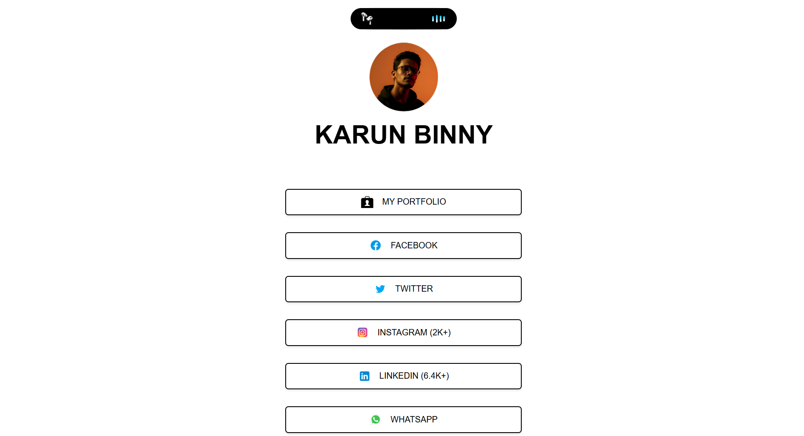

🌐 My Linktree Project

A simple and responsive Linktree-style personal links page built using HTML, CSS, and JavaScript. This project showcases all my social media and portfolio links, allowing visitors to easily connect with me through a single, centralized page.

🚀 Features

- Redirect Links: Each button redirects to the respective social media handle.

- Responsive Design: Works smoothly on all devices — desktop, tablet, and mobile.

-  Custom Styling: Clean UI with hover effects and personalized colors.

- Lightweight: Built with pure HTML, CSS, and JS.

- Centralized Access: Acts as a single hub for all online profiles.

🛠️ Technologies Used

- HTML5 – Structure and layout

- CSS3 – Styling and animations

- JavaScript (ES6) – Interactivity and link redirection

  
🔗 Live Demo

👉 View Project : https://karunbinny.netlify.app/
